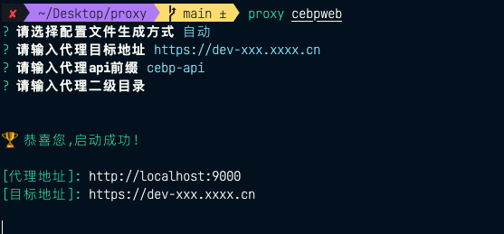

<!--
 * @Author: sroxck
 * @Date: 2023-11-17 15:23:46
 * @LastEditors: sroxck
 * @LastEditTime: 2023-11-20 16:36:27
 * @Description: 
-->

# proxy-static-server
proxy-static-server是一个本地静态文件代理的cli工具,通常用于 `vue` 项目打包后产生的静态文件即 `dist` 目录的代理工作,可以快捷简单的代理目标目录到指定服务器


## 安装

``` bash
npm i -g proxy-static-server
```

## 使用
在终端中输入 `proxy [dir]` 即可, 然后根据提示输入相应的参数即可
> 注意: 需要在被代理目录的上一层级目录中执行命令,如:目录结构是 `test/dist` 则需要在 `test `目录中执行 `proxy dist`

## 参数配置
在执行命令时,可以选择自动和手动两种配置方式
1. 自动配置,根据命令行提示输入`代理目标地址,api前缀,二级目录`,系统会自动在脚本执行目录生成 `proxy.yml`,下次代理时,读取该文件直接代理,无需配置
2. 手动配置,系统直接在脚本执行目录生成 `proxy.yml`,由用户直接修改 `proxy.yml` 配置项,重新启动代理即可


## Required
NodeJs >= 18.0.0

## 注意事项
